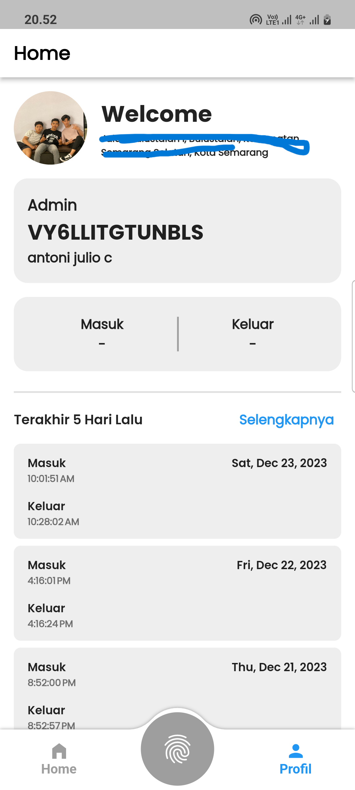
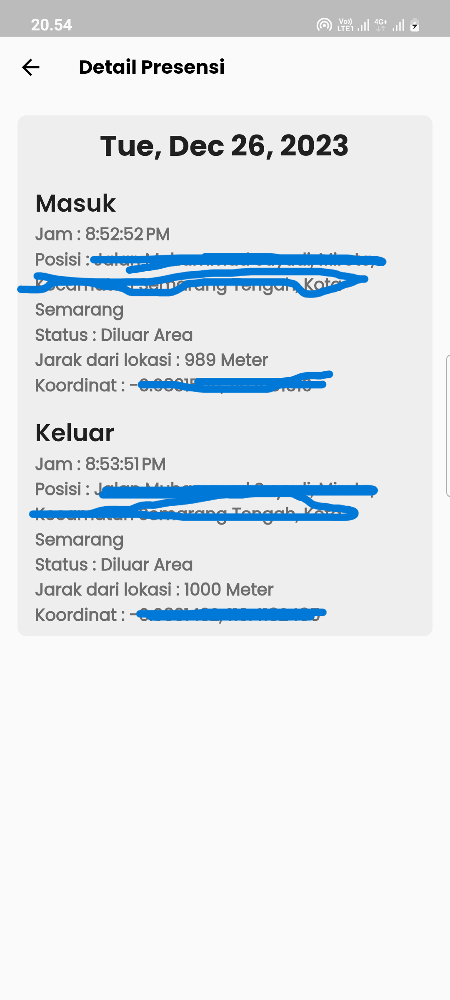
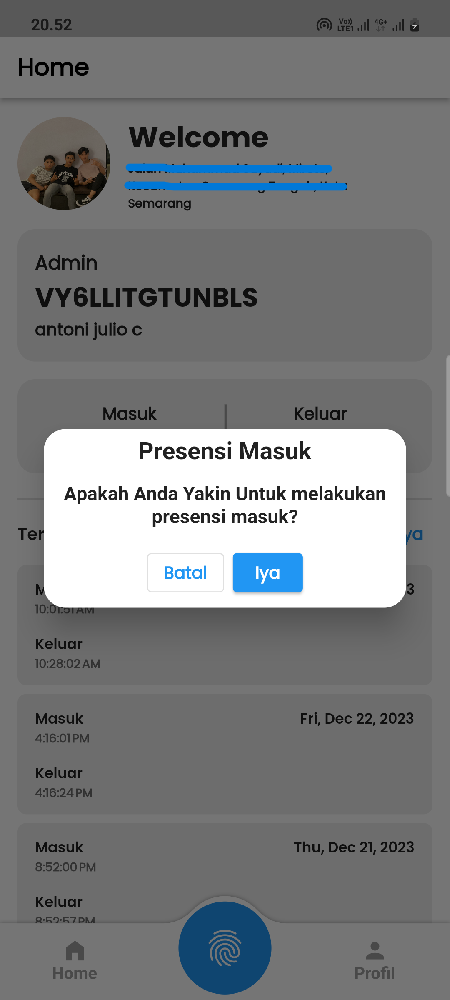
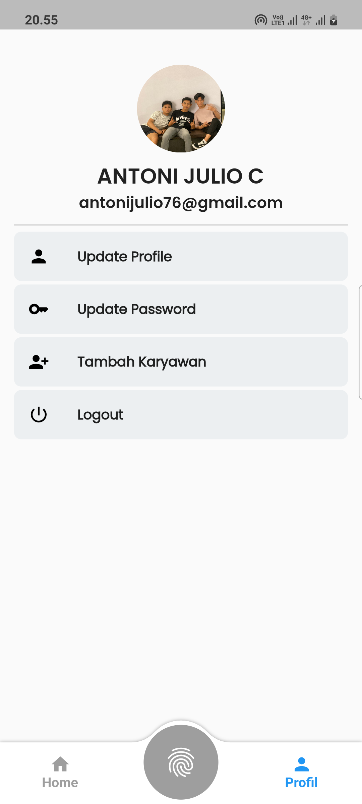

aplikasi magang semester 7 di [pt daffa jaya utama](https://g.co/kgs/qch6RZA)

# HIGHLIGHT SERTA CARA PENGGUNAAN APLIKASI

## lokasiawan

- project aplikasi presensi karyawan berbasis lokasi menggunakan state management getX
- aplikasi dapat merekam lokasi secara real time saat karyawan melakukan presensi
- menggunakan package [geolocator](https://pub.dev/packages/geolocator) untuk mendapatkan lokasi user dalam bentuk koordinat dan mengkonfersinya menjadi bentuk alamat menggunakan package [geocoding](https://pub.dev/packages/geocoding).
- terdapat 2 entitas sebagai pengguna aplikasi tersebut, yaitu admin dan karyawan.
- admin dapat menambahkan karyawan dan menghapusnya dari sistem.
- karyawan dapat melakukan presensi dan melihat semua presensi yang pernah dilakukan.

## installasi:

- clone repo ini dengan menjalankan perintah `git clone https://github.com/antonijulio/lokasiawan.git`.
- untuk mendapatkan semua dependencies jalankan perintah `flutter pub get` pada project yang telah di clone.

## REQUIREMENT

- silahkan hubungi [TELEGRAM SAYA](https://t.me/antonijulio) untuk authentifikasi pengguna.

## preview aplikasi

| Dashboard                       | Detail Presensi                       |
| ------------------------------- | ------------------------------------- |
|  |  |
| Dialog Presensi                 | Profil                                |
|  |  |
